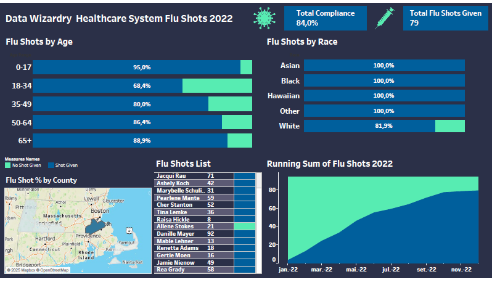

# 📊 Análise de Dados com SQL e Tableau

> Este projeto utiliza SQL para análise de dados e Tableau para visualização interativa.
>
> <p align="center">
  
</p>

## 🔍 Descrição do Projeto
O objetivo deste projeto é explorar um conjunto de dados sobre uma vacinação realizado no ano de 2022, em alguns distritos do Estados Unidos.

## 🛠️ Ferramentas Utilizadas
- **SQL**: PostgreSQL para extração dos dados.
- **Tableau**: Para criação dos dashboards. 

## 📂 Estrutura do Projeto
📁 [Análise_de_Vacinação_2022](https://github.com/viniwallaz/Flu_shot_Healthcare/tree/main) │-- 📜 [Instruções.md](https://github.com/viniwallaz/Flu_shot_Healthcare/blob/main/README.md) │-- 📊 [Dashboard.png](https://github.com/viniwallaz/Flu_shot_Healthcare/blob/main/capa_flu_shot_dash.png) │-- 📊 [Arquivo_Tableau_Dashboard](https://github.com/viniwallaz/Flu_shot_Healthcare/blob/main/Flu%20Shot%20Dash%20Portfolio.twb)   │-- 📷 [Vídeo_Dashboard](https://drive.google.com/file/d/1sIox8pxtp4JnuUajl39DVqd144BY7eWK/view?usp=sharing) │-- 📂 [SQL-queries](https://github.com/viniwallaz/Flu_shot_Healthcare/blob/main/Flu_shot_SQL_final_script.sql) │-- 📂 [Dataset_utilizado](https://github.com/viniwallaz/Flu_shot_Healthcare/blob/main/Flu%20Demo%20Data%20(1).csv)


## 🏗️ Passo a Passo da Análise

### 1️⃣ Coleta de Dados
Os dados foram extraídos desse repositório e link respectivamente: [Data_Wizardry_github](https://github.com/Data-Wizardry) ; [Flu_Shot_Healthcare_files](https://datawizardry.academy/flu-shot-dashboard/)

### 2️⃣ Consultas SQL Utilizadas
#### 🔹 Exemplo de Query para filtrar pacientes e suas idades:
```sql
SELECT DISTINCT patient
	FROM encounters AS e
	JOIN patients AS pat
	  ON e.patient = pat.id
	WHERE start between '2020-01-01 00:00' and '2022-12-31 23:59'
	  AND pat.deathdate is NULL
	  AND extract(month from age('2022-12-31',pat.birthdate)) >= 6;
