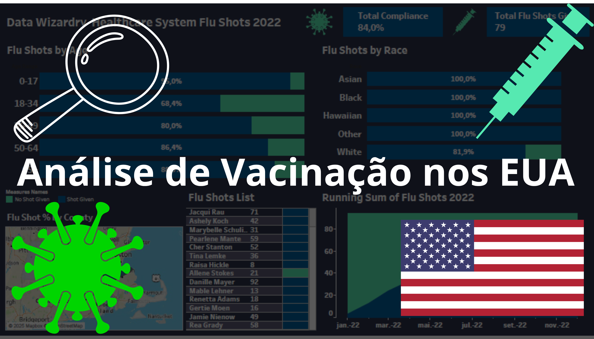

# Análise de vacinação nos Estados Unidos
TAGS: Análise Exploratória de Dados; Mineração de Dados; Redução de Dimensionalidade; Visualização de Dados; Filtragem de Dados; Seleção de Atributos; Data Storytelling

  

